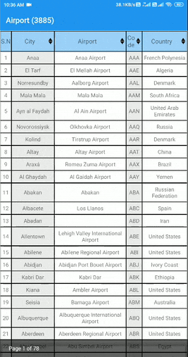

# JSON-Table-Pagination
Android app to display parsing of JSON data from REST API and display it in Table format with sorting and pagination.

### Steps include
- Parsing json data from an API.
- Display pased data in Tabular format using TableLayout.
- Apply pagination (display only 50 values per page).
- Sort in Ascending or Descending order by clicking on sort icon in table header.

### Screenshots: 
